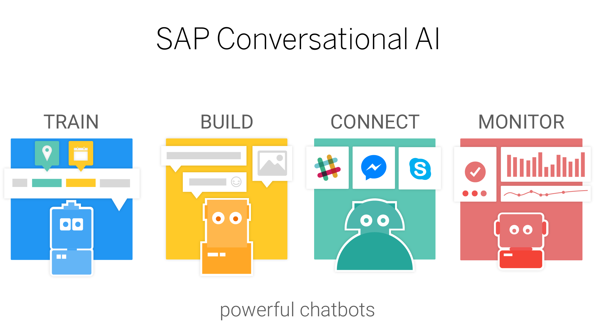
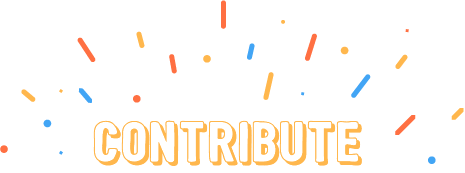

  

| [Getting Started](https://github.com/RecastAI/Recast.AI/blob/master/README.md#getting-started) | [API Documentation](https://recast.ai/docs/api-reference/) | [Builder Guide](https://recast.ai/docs/create-your-bot) | [Updates Status](https://github.com/RecastAI/Recast.AI/blob/master/README.md#status---major-updates) | [Contribute](https://github.com/RecastAI/Recast.AI/blob/master/README.md#contribute-or-create-new-sdks-for-our-api) | [Service Status](https://status.recast.ai/) | [License](https://recast.ai/terms) |
|---|---|---|---|---|---|---|

**[ :speech_balloon: Questions / Comments? Join the discussion on our community Slack channel!](https://slack.recast.ai/)**

## WHAT IS RECAST.AI?

We build products to help brands and individuals have a better understanding of user inputs.

-   **NLP API**: a unique API for text processing, and augmented training.
-   **Bot Building Tools**: all you need to create smart bots powered by Recast.AI's NLP API. Design even the most complex conversation flow, use all rich messaging formats and connect to external APIs and services.
-   **Bot Connector API**: standardizes the messaging format across all channels, letting you connect your bots to any channel in minutes.

**Don't reinvent the wheel, simply fork it from the best!**

Recast.AI is a **community platform**: just like on GitHub, you can fork any bot or intent to speed up your bot development. Discuss with other bot makers in the community [on our Slack](https://slack.recast.ai/) to learn all the tips and tricks.

## GETTING STARTED

The bot builder gives you access to: 

-   A **visual interface** to design the flow, build the conversation logic and set up replies.

-   **Webhook features** to connect your bot to your own API or other services to fetch external data.

### TUTORIALS
* [Your first bot [NodeJS]](https://blog.recast.ai/build-your-first-bot-with-recast-ai/) - Build your first bot with Bot Builder
* [Build a movie bot with Recast.AI [NodeJS]](https://recast.ai/blog/nodejs-chatbot-movie-bot/) - Overview of how to get started building your bot's server and calling third party APIs.
* [Build a cryptocurrency chatbot with Recast.AI [Python]](https://recast.ai/blog/python-cryptobot/) - Build a bot able to fetch cryptocurrencies price.

### RESOURCES
* [Bot Builder Guide](https://recast.ai/docs): Best practices and tips to use the Recast.AI platform 
* [API Documentation](https://man.recast.ai/) - API documentation

## STATUS - MAJOR UPDATES

* Bot Skills (December 4, 2017): Autonomous conversational modules included in our Bot Builder tool. [Learn More](https://recast.ai/blog/build-your-first-bot-with-recast-ai/?utm_source=crepe&utm_medium=bot)
* Expression Suggestions (October 5, 2017): Automatic suggestions while creating expressions = blazing fast training. [Learm More](https://recast.ai/blog/ai-building-ai/?utm_source=crepe&utm_medium=bot)
* Any Language (July 10, 2017): All existing languages are now available on our platform. [Learn More](https://recast.ai/blog/tuto-any-language/?utm_source=crepe&utm_medium=bot)

[FULL CHANGELOG](https://recast.ai/docs/api-reference/#changelogs)

### NEW FEATURES COMING SOON
- [x] Add sentiment analysis to the /request endpoint
- [x] Improve french entities detection
- [x] View entities in expressions in the train tab
- [x] Add conditional path in the Bot Builder depending the value of entities
- [x] Add collaborators in your bot
- [x] Add list of synonyms for your entities
- [x] Connect your bot directly in the platform (You can use [Bot Connector](https://botconnector.recast.ai) now)
- [x] Show which entities are tagged
- [x] Get metrics about your bot training
- [x] Deploy your code and host your bot
- [x] Spanish support
- [x] Twitter channel
- [x] Gitlab integration to deploy your repositories
- [x] Support private Gitlab repositories
- [x] Add a way to merge intents
- [x] German support
- [ ] Salesforce integration
- [ ] Add the ability to label entities in the Log Feed
- [x] Add Twitch channel

[PROJECT ROADMAP](https://github.com/RecastAI/Recast.AI/projects/1)

 

  

## Contribute or create new SDKs for our API
* [NodeJS](https://github.com/RecastAI/SDK-NodeJS)
* [Ruby](https://github.com/RecastAI/SDK-ruby)
* [Python](https://github.com/RecastAI/SDK-python)
* [JS Library](https://github.com/RecastAI/Library-JavaScript)
* [PHP](https://github.com/RecastAI/SDK-PHP)
* [Golang](https://github.com/RecastAI/SDK-Golang)
* [IOS](https://github.com/RecastAI/SDK-iOS)
* [Android](https://github.com/RecastAI/SDK-Android)

Check the next SDKs [list](https://github.com/RecastAI/Recast.AI/labels/help%20wanted)

## Contribute or create starter kits for the community
* [NodeJS](https://github.com/RecastAI/starter-NodeJS)
* [Ruby](https://github.com/RecastAI/starter-ruby)
* [Python](https://github.com/RecastAI/starter-python)
* [PHP](https://github.com/RecastAI/starter-PHP)

## Join the team
We are hiring, check our job opportunities [here](https://recast.ai/jobs)
